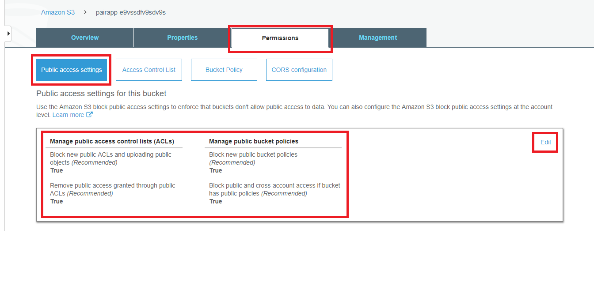
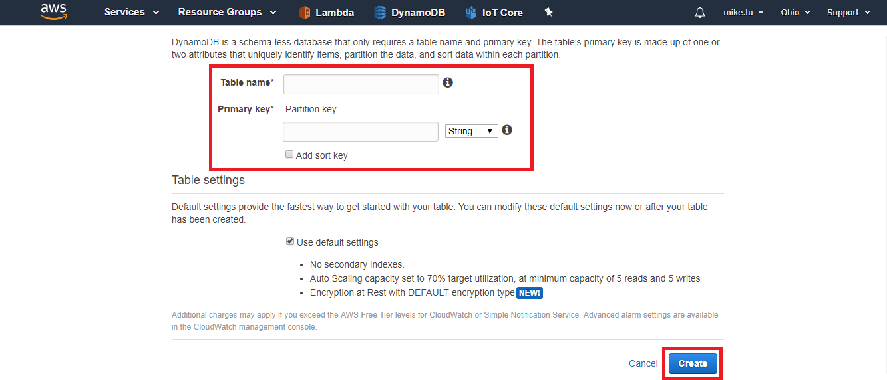

# Outline
* Outline
* [CYP Cloud Overview](#CYP-Cloud-Overview)
* [Techniques](#Techniques)
* [Step by Step](#Step-by-Step)
  * [IAM](#step-iam)
  * [Cognito](#step-cognito)
  * [S3 and Static Web Hosting](#step-s3-static-web-hosting)
  * [DynamoDB](#step-ddb)
  * [Lambda](#step-lambda)
  * [ReactJS concepts](#step-reactjs)

# CYP Cloud Overview
```
                           AWS IAM
                              |
                        Amazon Cognito   λ(function): AWS Lambda and usage
        ______________________|_______________________________
       |                 |                 |              |
       |                 |                 |              |
       λ             Amazon S3          AWS IoT          ...
(backup cognito)     (host web)            |
       |                 |                 |
       |                 |                 |
Amazon DynamoDB ←---λ----|--(rule engine)--|
       |                 |                 |
       |                 |                 |
 AWS Appsync-----CYP Cloud Application-----|
                                           |
                                        (MQTT)
                                     CYP Devices
```

---

# Techniques
## 1. `AWS IAM`

<p align="center"></p>  

`IAM (Identify and Access Management)`為連接所有服務的核心，只有在`IAM`授權過的存取才會在應用中生效。`Access Permission`可以透過`Policy`去制定。
- __[AWS IAM]__  
https://docs.aws.amazon.com/zh_tw/IAM/latest/UserGuide/introduction.html

## 2. `Amazon Cognito`

<p align="center"></p> 

`Cognito`透過`User Pool` `Identity Pool`管理所有應用程式中的使用者。透過使用者池，管理者及開發人員能夠更好的區分不同等級的使用者權限。
- __[Amazon Cognito]__  
https://docs.aws.amazon.com/zh_tw/cognito/latest/developerguide/what-is-amazon-cognito.html
- __[Serverless-stack create user pool__  
https://serverless-stack.com/chapters/create-a-cognito-user-pool.html
- __[Serverless-stack create federated identities pool]__ 
https://serverless-stack.com/chapters/create-a-cognito-identity-pool.html

## 3. `Amazon S3`
 
<p align="center"></p>  

`S3`除了提供付費的使用空間供整個Application運用，還能夠對靜態網頁的內容做管理 _(static web hosting)_，使得 __serverless__ 的架構更容易實現。
- __[Amazon S3]__  
https://docs.aws.amazon.com/zh_tw/AmazonS3/latest/dev/Welcome.html
- __[S3 Static Web Hosting]__  
https://docs.aws.amazon.com/zh_tw/AmazonS3/latest/dev/WebsiteHosting.html

## 4. `Amazon DynamoDB`

<p align="center"></p>

`DynamoDB`屬於 _"非關聯式資料庫"(Non-SQL database)_ 的一種。傳統的關聯式資料庫具備可靠性、穩定性；非關聯式資料庫則具有容易擴充、彈性的資料結構等優點。`Local Secondary Index, LSI` 及 `Global Secondary Index, GSI`的使用也能補足非關聯式資料庫在條件存取的劣勢。
- __[Amazon DynamoDB]__  
https://docs.aws.amazon.com/zh_tw/amazondynamodb/latest/developerguide/Introduction.html
- __[DynamoDB Secodary Indexes]__  
https://docs.aws.amazon.com/amazondynamodb/latest/developerguide/SecondaryIndexes.html

## 5. `AWS IoT`

<p align="center"></p>
   
`AWS IoT`提供了一種透過網路與終端裝置(embedded, mobile, pc, etc.)互動的介面。除了基本的 `Message Queuing Telemetry Transport, MQTT`訊息傳輸介面外，AWS還在那之上實現了裝置影子(_Device Shadow_)來掌握即時的控制與狀態更新、以及AWS Greengrass(gateway)來對一群裝置做管理。
- __[AWS IoT Core]__  
https://docs.aws.amazon.com/zh_tw/iot/latest/developerguide/what-is-aws-iot.html
- __[AWS IoT Shadow]__  
https://docs.aws.amazon.com/zh_tw/iot/latest/developerguide/iot-device-shadows.html
- __[AWS IoT Greengrass]__  
https://docs.aws.amazon.com/zh_tw/greengrass/latest/developerguide/what-is-gg.html

## 6. `AWS Lambda`

<p align="center"></p>

## 7. `AWS Appsync`

<p align="center"></p>

`#TODO`

## 8. Web Application
第一，由於`Amazon S3`只提供靜態網頁託管的服務。第二，使用ReactJS開發的網頁應用可以被build成S3能夠託管的內容。ReactJS基於Node.js，Node.js的原身又是JavaScript，因此學習使用這三樣東西是必須的。除此之外，Node.js會使用到的套件會使用`npm`做為套件管理系統，也需要學習如何使用npm來管理每個project的套件。
- __[npm Tutorial]__  
https://docs.npmjs.com/cli/npm
- __[Javeacript Tutorial]__  
https://www.w3schools.com/js/
- __[Node.js Tutorial]__  
https://www.w3schools.com/nodejs/
- __[ReactJS Tutorial]__  
https://www.tutorialspoint.com/reactjs/

為了要在web上存取AWS的服務，會使用到一些Node.js套件:
- __[AWS SDK for JavaScript]__  
https://docs.aws.amazon.com/AWSJavaScriptSDK/latest/AWS.html
- __[AWS Ampllify on JavaScript]__  
https://aws-amplify.github.io/docs/js/start?platform=purejs

---

<a id="step-iam"></a>

# Step by Step

## Step: IAM

### Basic Rule #1 Protect Your Credential
透過IAM政策提供許可時，僅授予一個對象其最低需要的權限。另外，小心保存您的任何密碼、存取ID、私鑰等等，不要放入任何可以供其他人瀏覽的 __"程式碼"__ 中，像是github、bitbucket等等。舉例:
``` python 
server = None
server_init(server, 'my_server')
server_init_auth(server, 'my_account', 'my_password1234') # dangerous
```
### Basic Rule #2 Keep an Eye on Resource Usage

  

"Pay as you go"是AWS的基本原則，釋放任何你不再需要用到的資源，並且到帳單儀表板檢視您的預估帳單。AWS也提供了 [Monthly Calculator](http://calculator.s3.amazonaws.com/index.html)做為付費計算工具。  

#### - Getting Start

1. 在[IAM Console](https://console.aws.amazon.com/iam/home)左方導覽列找到「Group」→「Create New Group」
2. 輸入group name→「Next Step」


3. Attach policy (permission) 
屬於這個「群」的「使用者」都會擁有policy定義的權限。有許多預設policy可以選擇，但也能自訂一個policy


4. 「Next Step」→「Create Group」  
5. 在[IAM Console](https://console.aws.amazon.com/iam/home)左方導覽列找到「Users」→「Add user」


6. 輸入user name、access type選"_Programmatic access_"→「Next: Permission」
這個選項代表 "此user將會透過程式碼來存取服務"
7. 「Add user to a group」→選擇剛才創建的group (將group的權限套用到新user上)→「Next: Review」


8. 「Final check」→「Create User」
9. <font color="#dd0000">重要:</font> 最後是一個可供下載 _Access key ID_ 和 _Secret access key_ 的頁面，當離開這個頁面後就再也無法下載，請妥善保存。 


### Additional Topic # 1 : AWS Lambda CloudWatch Logs Policy
1. 在 IAM 「Create policy」→「Choose a service」選擇 「CloudWatch Logs」。
2. 確保選擇下列許可:
    - `CreateLogGroup`
    - `CreateLogStream`
    - `DescribeLogStreams`
    - `GetLogEvents`
    - `PutLogEvents`
    - `PutRetentionPolicy`

---

<a id="step-cognito"></a>

## Step: Cognito

Amazon Cognito提供了 __Cognito User Pool, 使用者集區__ 和 __Cognito Federated Identity Pool, 聯合身分集區__。簡單來說，user pool用來管理使用者的基本資料，例如登入用的使用者名稱、帳號密碼，或是電話號碼等等；而每個使用者的真正身分是在identity pool管理，這決定了某個使用者擁有哪些服務的受限存取權。  

更進一步解釋的話，user pool是扮演一個使用者 _"提供者"(provider)_ 的角色，而 federated identity pool則是將所有的 provider 提供的 user 做聯合的身分管理。因此，我們不僅能在AWS增加新使用者，還能透過第三方提供者，例如 Facebook、Google+ 等，來增加服務的使用者，就是基於這個機制。

#### - Getting start
1. 進入Amazon Cognito console →「Manage User Pools」→「Create a user pool」→ 輸入Pool name，選擇「Review defaults」

 

2. 在左方選單選擇「Attibutes」→ 勾選「Email address or phone number」→開啟「Allow email addresses」讓使用者可以用email來驗證和登入


3. 在左方選單選擇「Review」→「Create pool」

__其他設定:__
<table>
    <tr style="text-align: left">
        <th>Panel</th>
        <th>Function</th>
    </tr>
    <tr>
        <td><code>Attributes</code></td>
        <td>
        <li><code>Username</code>: 決定可以用什麼個人資料登入，例如電子郵件、電話、自定等等</li>
        <li><code>Standard Attributes</code>: 決定註冊時需要哪些使用者基本資料(標準)</li>
        <li><code>Custom Attributes</code>: 自訂所需要的註冊基本資料</li></td>
    </tr>
    <tr>
        <td><code>Policies</code></td>
        <td>
        <li><code>Password Policy</code>: 定義密碼強度需求</li>
        <li><code>Allow Sign-up</code>: 使用者能自行註冊或只允許管理這增加使用者</li>
        <li><code>Expiration</code>: 定義由管理員創建的帳號多久會過期</li></td>
    </tr>
    <tr>
        <td><code>MFA and Verification</code></td>
        <td>
        <li><code>Enable/Disable</code>: 開啟/關閉多方驗證功能</li>
        <li><code>Verification Attributes</code>: 決定驗證手段</li>
        <li><code>Verification Role</code>: 定義執行驗證動作的執行角色</li></td>
    </tr>
    <tr>
        <td><code>Message customizations</code></td>
        <td>
        <li><code>Verification message</code>: 自訂郵件驗證訊息</li>
        <li><code>Invitation message</code>: 自訂郵件邀請訊息</li></td>
    </tr>
    <tr>
        <td><code>Tags</code></td>
        <td>在使用者集區加入標籤</td>
    </tr>
    <tr>
        <td><code>Devices</code></td>
        <td>決定是否儲存使用者存取服務的裝置</td>
    </tr>
    <tr>
        <td><code>App clients</code></td>
        <td>決定哪種應用客戶端可以存取此使用者集區</td>
    </tr>
    <tr>
        <td><code>Triggers</code></td>
        <td>
        <li><code>Pre Sign-up</code>: 使用Lambda function 自訂註冊工作流程</li><br>
        <li><code>Pre Authentication</code>: 使用 Lambda function 自訂認證(登入)工作流程</li><br>  
        <li><code>Custom Message</code>: 使用 Lambda function 自訂校驗或多方驗證訊息</li> <br> 
        <li><code>Post Authentication</code>: 使用 Lambda function 自訂登入後的工作流程</li><br>  
        <li><code>Post Confirmation</code>: 使用 Lambda function 自訂校驗使用者後的工作流程</li><br>  
        <li><code>Define Auth Challenge</code>: 使用 Lambda function 初始化客製的認證流程</li> <br> 
        <li><code>Create Auth Challenge</code>: 使用 Lambda function 創建認證時的 challenge，會在 "Define Auth Challenge" 後被呼叫</li> <br> 
        <li><code>Verify Auth Challenge Response</code>: 使用 Lambda function 校驗使用者對 challenge 的回應</li><br>  
        <li><code>User Migration</code>: 使用 Lambda function 自訂登入或忘記密碼時的工作流程</li><br>  
        <li><code>Pre Token Generation</code>: 使用 Lambda function 自訂權杖的產生流程</li></td> 
    </tr>
</table>


4. 創建完成後頁面會自動跳轉到該集區的一般設定頁面，也能在Amazon Cognito主控台點選指定集區進入，並記住集區的「Pool id」


5. 在設定介面左方「General settings」中選擇「App client」→「Add an app client」


6. 輸入「App client name」和「Refresh token expiration(days)」。
7. 取消勾選「Generate client secret」，因為使用JavaScript SDK不支援這種 client secret
8. 勾選「Enable sign-in API for server-based authentication (ADMIN_NO_SRP_AUTH)」，這讓我們可以通過 AWS CLI 管理使用者集區
 


9. 點擊「Create app client」並記住「App client id」


10. 進入Amazon Cognito console → Manage Federated Identities→「Create new identity pool」→ 輸入Identity pool name

11. 在下方「Authentication Providers」區塊中選擇「Cognito」分頁，並輸入新創立的 User pool id 和 App client id


12. 點選「Create Pool」後會跳轉到 one-click role 頁面，展開「Hide Details」→「View Policy Document」可以檢視和編輯"驗證通過"和"驗證失敗"時將會套用的角色(政策) → 點選「Allow」產生這些角色


---
<a id="add-topic-nodejs-cognito-login"></a>
### Addiotnal Topic #1: 使用 NodeJS 實現 Cognito 登入


`AWS Amplify`提供了實用的模塊讓開發者更容易實現 _授權存取資源_ 這樣的應用模式。在這段主題會說明如何引入`AWS Amplify`模塊來實現讓使用者透過 Amazon Cognito 登入。關於 ReactJS的基本概念，請[參考](#step-reactjs)。

#### - Getting start
1. 使用 terminal 安裝必須的套件
```
npm install --save aws-amplify aws-amplify-react amazon-cognito-identity-js
```

2. 在`.js`檔中導入模塊，並在程式碼中設定好配置。  

```javascript
import Amplify, { Auth } from 'aws-amplify';
Amplify.configure({
    Auth: {
        mandatorySignIn: true,
        region: YOUR_COGNITO_REGION,
        userPoolId: YOUR_COGNITO_USER_POOL_ID,
        identityPoolId: YOUR_COGNITO_IDENTITY_POOL_ID,
        userPoolWebClientId: YOUR_COGNITO_APP_CLIENT_ID
    }
});
```

3. 準備登入用的component。帳號密碼的取得方式通常是靠圖形介面讓使用者輸入，在這裡先忽略。如果有需要帳號密碼以外的登入資訊需求，自行在程式碼和網頁介面中增加就可以了。

```javascript
import React, { Component } from 'react';
class Login extends Component {
    constructor(props) {
        super(props);
        this.state = {
            email: '',
            password: '',
            cognito_user: null,
            cognito_session: null,
        }
    }

    signIn = async () => {
        try {
            let user = await Auth.signIn(this.state.email, this.state.password);
            this.setState( { cognito_user: user } );

            if (user.challengeName === 'SMS_MFA' ||
                user.challengeName === 'SOFTWARE_TOKEN_MFA') {
                // we won't handle this situation here.
            } else if (user.challengeName === 'NEW_PASSWORD_REQUIRED') {
                // we won't handle this situation here.
            } else if (user.challengeName === 'MFA_SETUP') {
                // we won't handle this situation here.
            } else {
                alert("Logged In!");
                let session = await Auth.currentSession();
                this.setState( { cognito_session: session } );
            }
        } catch (e) {
            alert(e.message);
        }
    }
}
```

在這段程式碼中我們做了幾件事:  
- [x] 初始化 component 狀態，在狀態中增加`username`、`password`、`cognito_user`、`cognito_session`四種屬性。`username` 和 `password`用來儲存從使用者介面或外部得到的帳號密碼，`cognito_user` 包含一些使用者狀態，`cognito_session`包含一些用來存取其他 AWS 服務的憑證，例如 _JSON Web Token, JWT_。
- [x] 加入一個可以被觸發的"__非同步函式__"，這個函式會呼叫`Auth.signIn()`這個方法。這個方法"承諾"一定會 (可能不是馬上) 回傳一個結果(請參考 [Promise](https://developer.mozilla.org/zh-TW/docs/Web/JavaScript/Reference/Global_Objects/Promise))。為了應付這種需要等待的狀況，可以透過`async`運算子去表達一個函式為非同步函式，被表達為"非同步"的函式能夠在內部使用`await`運算子，去等待承諾函式的回傳值。
- [x] 根據`Auth.signIn()`的回傳值，我們可以知道這個使用者的驗證情形。在範例中我們只處理登入成功的情況，在登入成功後將使用者資訊和 session 更新到 component 的狀態中。

> 若是之後需要處理其他驗證結果，例如需要多方驗證、需要新密碼等等，同樣在這個函式中處理

### Addiotnal Topic #2: 解決 "需要新密碼" 

當使用者不是自己註冊帳號，而是由管理員在 Amazon Cognito User Pool 建立帳號，此時使用者用預設密碼登入後，仍然不能存取其他資源 (challengeName 回傳`NEW_PASSWORD_REQUIRED`)。以下是處理重設密碼的核心步驟:  

#### - Getting start

1. 準備重設密碼的 component。為此，我們準備了一組新密碼和重複確認密碼，還要包含登入成功時的使用者物件，這在接下來會使用到。

```javascript
import React, { Component } from 'react';
import Amplify, { Auth } from 'aws-amplify';
class ResetPassword extends Component {
    constructor(props) {
        super(props);
        this.state = {
            new_password: '',
            double_check_password: '',
            cognito_user: COGNITO_USER
        }
    }
}
```

2. 建立處理重設密碼的函式。

```javascript
class ResetPassword extends Component {
    constructor(props) {
        // the same...
    }
    resetPassword = async () => {
        if (this.state.new_password === this.state.double_check_password) {
            try {
                Auth.completeNewPassword(
                    this.state.cognito_user,
                    this.state.new_password,
                    // optional parameter
                    // if your cognito user pool needs other information
                    // add them here
                    // example: 
                    // { email: this.state.email, phone_number: this.state.phone }
                ).then(() => {
                    alert('Reset password successfully.');
                });
            } catch (e) {
                alert(e.message);
            }
        }
    }
}
```

這段程式碼宣告了一個非同步函式`resetPassword()`，當新密碼確認無誤後，呼叫一個`Auth.completeNewPassword()`方法來完成新密碼的設定。要取得這個方法的回傳值同樣需要等待一段時間，我們使用了另一種等待手段`then()`。`then()`需要帶入一個回呼函式 (callback) 作為參數，當前面的承諾函式完成時，觸發回呼函式的動作。

---

### Addiotnal Topic #3: 註冊新使用者

AWS Amplify 提供了 API 來讓網頁應用可以處理使用者自行註冊的動作。整個 cognito user 的註冊過程分為兩階段: 「註冊」→「確認」。以下範例會實際示範這兩個步驟:

1. `Auth.signUp()`方法，向 cognito 發出註冊使用者請求。

```javascript
handleRegister = async () => {
    try {
        await Auth.signUp({
            username: YOUR_COGNITO_REGISTER_USERNAME,
            password: YOUR_COGNITO_NEW_PASSWORD,
            // optional parameter
            // if your cognito user pool needs other information
            // add them here
            // example: 
            // attributes: { phone_number: this.state.phone }
        });
    } catch (e) {
        alert(e.message);
    }
}
```

`Auth.signUp()`方法使用起來很簡單，只要帶入一個包含帳號密碼屬性的物件作為參數即可。如果需要其他註冊資訊，請加在`attributes`參數之中，如同範例註解。注意如果使用者集區設定有勾選「Allow email address」，這邊的 username 需要帶入電子郵件。

2. `Auth.confirmSignUp()`方法，透過寄送到電子郵件信箱的驗證碼，確認使用者身分。

```javascript
handleConfirmRegister = async () => {
    try {
        let data = await Auth.confirmSignUp( YOUR_COGNITO_REGISTERED_USERNAME, CONFIRM_CODE_SENT_TO_YOUR_EMAIL, {
            forceAliasCreation: true
        });
        alert(data);
    } catch (e) {
        alert(e.message);
    }
}
```

`Auth.confirmSignUp()`方法使用起來同樣不難，主要帶入兩個參數: 剛才註冊用的使用者名稱和使用者收到的電子郵件驗證碼。如果驗證成功，這個方法會回傳"SUCCESS"字串。

---

<a id="step-s3-static-web-hosting"></a>

## Step: S3 and Static Web Hosting
`Simple Storage Service, S3`是 AWS 提供的儲存服務，儲存在雲端的檔案能夠被擁有權限的使用者存取。在 CYP cloud 中，我們主要會用到`S3`的地方有  

1. 使用靜態網頁代管服務
2. 存放 AWS Lambda 使用的程式碼  

### 使用靜態網頁代管服務
相對於動態網頁，靜態網頁 (static web) 僅交付內容給網頁訪客，其內容包括: HTML，JavaScript，檔案等等，但不包括伺服器端的應用程式或程式碼。如果需要自行管理伺服器端的環境與基礎設施，請參考其他服務。 

__S3靜態網頁代管服務優點:__

- [x] 成本低:   
`S3`僅交付儲存內容，因此僅對儲存內容的大小計費  
如果搭配使用Amazon Route 53 (註冊網域) 和 Amazon CloudFront (內容交付) ，費用額外計算。
- [x] 可靠性高:  
因`S3`僅交付儲存內容，被託管的網頁可靠度則依賴儲存體的可靠度和網頁邏輯設計的可靠度，減少了伺服器與基礎設施運行的不確定性。
- [x] 可擴展性:  
透過 Amazon CloudFront，可以將內容在許多位置部署，訪客的存取會被導向到最適當的存取點。
- [x] 無須伺服器管理:  
AWS將儲存的內容交付給網頁訪客後，所有程式碼皆在客戶端 (的瀏覽器) 執行，無須伺服器的支援，但也依賴瀏覽器對程式碼的相容程度。

#### - Getting start
1. 進入 Amazon S3 [主控台](https://s3.console.aws.amazon.com)介面，點擊「Create bucket」  

2. 輸入「Bucket name」，並選擇「Region」，代表儲存體的位置。某些服務可能有地區相依性，盡量選擇和將會需要存取的服務同一區域。  

3. 將我們的 ReactJS 應用網頁專案 build 成部署用的包裹 (如果還沒有自己建立的 ReactJS 專案，請[參考](#step-reactjs))，在專案資料夾根目錄使用 terminal 輸入`npm run-script build`指令或`yarn build`指令。只要打開`package.json`就能發現，這兩個指令實際上最後都會被轉換成`react-script build`來執行。在最佳化網頁應用後應該會在 terminal 看到類似這些文字:

4. 我們能夠用`serve`套件來在我們的本地端架設剛剛優化好的網頁應用，但現在不需要這樣做。我們要將 build 好的內容上傳到`S3`的 bucket 內。在 terminal 使用`aws cli`來同步本地資料夾和 S3 bucket。若您還未安裝`aws cli`，請[參考](https://aws.amazon.com/tw/getting-started/tutorials/backup-to-s3-cli/#install-cli)。

> 注意不要直接將`build`資料夾上傳，而是要上傳`build`資料夾的內容。

- Windows

```
aws s3 sync "C:\path\of\reactapp\build\" s3://MY_S3_BUCKET_NAME/ --profile my-default-profile
```

- OS X / Linux

```
aws s3 sync "/path/of/reactapp/build/" s3://MY_S3_BUCKET_NAME/ --profile my-default-profile
```


5. 上傳/同步成功後，可以在`S3`主控台介面點選 bucket 查看裡面有哪些檔案。在上面的分頁欄選擇「Properties」→「Static Website hosting」→ 勾選「Use this bucket to host a website」


6. 將 React Application 的網頁進入點檔名 (通常是`index.html`) 填入「index document」與「Error document」欄位 → 按下「Save」  


7. 現在切換到「Permissions」 分頁 → 選擇「Public access settings」→ 點選下方區塊的「Edit」。將所有選項取消勾選，開放更改 bucket 設定。更改完成後按「Save」，會跳出確認視窗，輸入提示字串以確認。



8. 同樣在「Permissions」 分頁 → 選擇「Bucket Policy」→ 在下方文字區域填入以下政策 → 點選「Save」儲存。__注意下方 `YOUR_BUCKET_NAME` 部分要更換成 bucket 名稱__

```
{
    "Version": "2012-10-17",
    "Statement": [
        {
            "Sid": "PublicReadForGetBucketObjects",
            "Effect": "Allow",
            "Principal": "*",
            "Action": "s3:GetObject",
            "Resource": "arn:aws:s3:::YOUR_BUCKET_NAME/*"
        }
    ]
}
```


在「Properties」→「Static website hosting」可以查看託管網頁的 endpoint，點選可以前往剛剛建立的網頁應用。


---

<a id="step-ddb"></a>

## Step: DynamoDB

Amazon DynamoDB 屬於非關聯式資料庫 ( Non-Relational Database )。過往的關聯式資料庫，為了因應當時的計算資源非常寶貴，需要將資料庫內的資料結構重組，實現強大的條件式存取，減少 computer 在 query 完成後還要花費額外的計算資源去整理資料的負擔。這造成的 overhead 就是資料庫的設計、管理、擴充困難。非關聯式資料庫保留資料原本的結構，通常是以 Javascript 物件表示法 ( JavaScript Object Notation, JSON ) 來儲存一筆資料，因此這筆資料也沒有一定需要具備某些欄位，只有主鍵是 ( primary key ) 必需的。

> 使用 MongoDB 時不需要主動在一筆資料中加入主鍵，在沒有指定主鍵 ( `_id` field ) 時會自動生成。使用 DynamoDB 則一定需要在 table 中指定一個 primary key 欄位。

如果我們的應用具有其中一些特性時，可以使用非關聯式資料庫來減少管理成本和增加彈性:
- [x] 需要儲存 __序列化__ 的資料 ( serialized data )，例如陣列、清單、曲線等等。
- [x] 在同一個 table 中的資料卻 __需要含有不同屬性__
- [x] __難以預先定義__ 的資料模型
- [x] __大規模__ 的資料庫 (成本問題)
- [x] 已正規化資料庫有需要以 __非正規化__ 來 ( 透過增加冗餘資料 ) 增加讀取效能 
> [Definition of Wikipedia](https://en.wikipedia.org/wiki/Denormalization)  
> ## Denormalization
> ... In computing, __denormalization__ is the process of trying to improve the read performance of a database, at the expense of losing some write performance, by adding redundant copies of data or by grouping data. ...
> A __normalized design__ will often "store" different but related pieces of information in separate logical tables (called relations).

### Capacity Unit
Amazon DynamoDB 的讀寫動作由 __Read Capacity Unit, RCU__ 和 __Write Capacity Unit, WCU__ 負責。一個 RCU 每秒能讀取 4 KB 的資料、一個 WCU 每秒能寫入 1 KB 的資料，又每次的讀取/寫入至少需要一個 RCU / WCU。以下是一些對於 capacity unit 的限制:  
1. 可以在 table 創建出來之後再調整 CU 的數量。
    - __每天最多 4 次__
    - __若一個小時內沒有更動，可再額外增加 1 次__
2. 每個 table 和帳號能分配的最大 CU 數量是有上限的，這個 __上限會根據地區而有所不同__。
    - 每個 table 能分配最多 __10000 RCUs__ 和 __10000 WCUs__
    - 每個帳號能分配最多 __20000 RCUs__ 和 __20000 WCUs__

### Database Components
Amazon DynamoDB 由 __Table, item, 和 attirbutes__ 組成。Table 是 item 形成的集合，item 是 attributes 形成的集合。每個 item 的大小上限為 400 KB，這包含了鍵名稱字串與鍵值。

```
table: 
    item1:
        key1 <<<A data type>>>: value1,
        key2 <<<B data type>>>: value2,
        ...
    item2:
        ...
```

<p align="center"></p>  

### Data Type
以下是 Amazon DynamoDB 可接受的 value 型態:

| Type           | DynamoDB Type                            | Low-level JSON API |
| -------------- | ---------------------------------------- | ------------------ |
| String         | `String`                                 | __S__              |
| Integer, Float | `Number`                                 | __N__              |
| Timestamp      | `String` or `Number`                     | __S or N__         |
| Blob           | `Binary`                                 | __B__              |
| Boolean        | `Bool`                                   | __BOOL__           |
| Null           | `Null`                                   | __NULL__           |
| List           | `List`                                   | __L__              |
| Set            | `Set` of `String`, `Numner`, or `Binary` | __SS, NS, or BS__  |
| Map            | `Map`                                    | __M__              |

### Primary Key
Table 裡面的每個 item 都需要有一個主鍵，Amazon DynamoDB table 主鍵的組成可能有這兩種類型:
- 由一個 __分割區索引鍵 ( Parition key, 簡稱分區鍵 )__ 組成，此時 table 中的每個 item，都必須擁有一個值為唯一的分區鍵 。分區鍵屬於一種 __屬性 ( attribute )__， 分區鍵的雜湊 ( hash ) 用來決定 item 的實際存放位置。擁有不同的分區鍵、但分區鍵有相同雜湊值的 item 同樣會被放在同一塊儲存體上 ( 這也可能影響到存取速度 ) 。
- 由一個 __分區鍵__ 與一個 __排序索引鍵  ( Sort key, 簡稱排序鍵 )__ 組成，此時 table 中的不同 item 可能會有相同的分區鍵值，但擁有相同分區鍵的 item 不會有重複的排序鍵值。排序鍵顧名思義，用來排序 query 結果。

### Secondary Index

__次要索引__ ( Secondary Index ) 不是必須使用的功能，是可以在某些情況下加速 query 的輔助工具。假設今天我們的 query condition 是分區鍵 ( patition key ) 以外的屬性，例如，查詢所有 "temperature" 屬性大於 30 的 item。這個時候如果不使用次要索引，我們就需要掃描整個資料表，並且丟棄那些溫度小於等於 30 度的資料。這種作法明顯沒有效率，因為不只需要多處理不必要的資料，而且與 DynamoDB 之間大多數的 __"計費"__ 流量都浪費了。如果一定需要用掃描操作 ( 儲存次要索引並不是不用成本，而且有數量與大小限制 )，可以用 `FilterExpression` 參數來避免條件外的 item 流量傳回給應用，但在 DynamoDB 的「掃描」動作仍然存在。當資料表越大，這項操作將會越費時 ( 因為不使用 capacity unit, filter 操作不須額外的付費)。

> 關於資料表的擷取 ( query )，[AWS文件](https://docs.aws.amazon.com/amazondynamodb/latest/developerguide/GettingStarted.NodeJs.04.html)說明了為何在主鍵僅由唯一分區鍵構成時，實作條件式存取必須要先掃描整個資料表。  
> ## Step 4: Query and Scan the Data  
> You can use the query method to retrieve data from a table. __You must specify a partition key value; the sort key is optional__. 

為了這種應用情境，兩種次要索引誕生了，分別是 __本機次要索引 ( Local Secondary Index, LSI )__ 和 __全域次要索引 ( Global Secondary Index )__。次要索引的可以簡單把它看作另一個資料表，就像我們原本的資料表的一部份分身，它們複製一部分原資料表的欄位 ( 屬性 )。  

兩種次要索引最主要的不同是:
 - LSI 可以和原資料表有不同的 __排序鍵 ( sort key )__，但需要和原資料表擁有一樣的分區鍵，這和分區鍵的用途有關，也是為什麼被它叫做「本機」次要索引。使用 LSI 可以讓我們只擷取部分原資料表中的物件，並省去排序的功夫。LSI 有 10GB 大小限制。
  - GSI 可以和原資料表有  __不同的分區鍵與排序鍵__，這讓次要索引的設計彈性增加。GSI 沒有大小限制，但通常以 10GB 區分應使用 LSI 或是 GSI。

應用程式對次要索引的所有資料更新，都會自動應用在原資料表上。這並非是 __強一致性 ( Strong Consistency )__ 的操作，而是 __最終一致性 ( Eventually Consistency )__ 操作，換句話說，更新並不會馬上反應到所有資料表和索引上。


#### - Getting start
1. 在 Amazon DynamoDB [主控台介面](https://console.aws.amazon.com/dynamodb)找到「Create table」→ 輸入「Table name」和「Primary key」區域的「Parition key」→「Create」



### Additional Topic #1: 使用 JavaScript 在 table 中新增 item

為了更了解 Amazon DynamoDB 的各種特性，我們會用 JavaScript 實例示範對資料庫的操作。在那之前，我們先假設我們需要一個存放裝置資訊的 table:

<table>
    <caption>Table Attributes</caption>
    <tr style="text-align: left;">
        <th></th>
        <th>id</th>
        <th>nickname</th>
        <th>model</th>
        <th>version</th>
        <th>backup</th>
    </tr>
    <tr>
        <td>Format</td>
        <td>MAC address ( string )</td>
        <td>0-1000 ( string )</td>
        <td><li><code>CPLUS-V8H8HP</code></li><li><code>CDPS-CS6</code></li><li><code>CPLUS-421PLV</code></li></td>
        <td><code>[0-9]:[0-9]:[0-9]</code></td>
        <td><code>"null"</code></td>
    </tr>
    <tr>
        <td>Example</td>
        <td><code>25:5b:ad:f4:0f:4b</code></td>
        <td><code>847</code></td>
        <td><code>CPLUS-V8H8HP</code></td>
        <td><code>7.5.1</code></td>
        <td><code>"null"</code></td>
    </tr>
</table>

1. 宣告一個`rand()`函式，讓我們能隨機產生這些屬性值

```javascript
function rand(type) {
    var ret = [];
    switch (type) {
        case 'mac':
            for (let i = 0; i < 6; i++) {
                let tmp = 1 + Math.floor(Math.random() * 253);
                ret[i] = tmp.toString(16);
                if (ret[i].length < 2) {
                    ret[i] = '0'+ret[i];
                }
            }
            return ret.join(':');
        case 'version':
            for (let i = 0; i < 3; i++) {
                let tmp = Math.floor(Math.random() * 9);
                ret[i] = tmp.toString();
            }
            return ret.join('.')
        case 'model':
            var sample = ['CPLUS-V8H8HP', 'CDPS-CS6', 'CPLUS-421PLV'];
            return sample[Math.floor(Math.random() * 3)];
        case 'nickname':
            return Math.floor(Math.random() * 1000).toString();
        case 'backup':
            return 'null';
        default:
            break;
    }
}
```

2. 使用`npm install --save aws-sdk`安裝 AWS JavaScript SDK 模塊。
3. 宣告用來 create item 的 component，利用[生命週期函式](#concept-state-lifecycle)`componentDidMount()`來在 component 準備好的時候將之前 [Cognito 登入](#add-topic-nodejs-cognito-login)成功得到的 session 載入到 AWS SDK 中。要小心即使登入成功，user 和 session 卻尚未載入的情況。

```javascript
import React, { Component } from 'react';
import AWS from 'aws-sdk';
class CreateDevice extends Component {
    componentDidMount() {
        try {
            const session = this.props.getSession();
            let loginToken = {};
            loginToken[`cognito-idp.${YOUR_COGNITO_REGION}.amazonaws.com/${YOUR_COGNITO_USER_POOL_ID}`] = session.getIdToken().getJwtToken();
            AWS.config.region = YOUR_COGNITO_REGION;
            AWS.config.credentials = new AWS.CognitoIdentityCredentials({
                IdentityPoolId: YOUR_COGNITO_IDENTITY_POOL_ID,
                Logins: loginToken
            });
            this.ddbclient = new AWS.DynamoDB.DocumentClient({ region:AWS.config.region });
        } catch (error) {
            // handle set credential fail
        }
    }
} 
```

4. 在 component 中宣告一個在 table 中加入 item 的函式`create()`，這個新 item 的屬性值為隨機產生。

```javascript
class CreateDevice extends Component {
    // ...
    create = async (event) => {
        event.preventDefault();
        AWS.config.credentials.get((err) => {
            if (!err) {
                var params = {
                    TableName: YOUR_TABLE_NAME,
                    Item: {
                        id: rand('mac'),
                        version: rand('version'),
                        model: rand('model'),
                        nickname: rand('nickname'),
                        backup: rand('backup'),
                    }
                }
                this.ddbclient.put(params, function (err, data) {
                    if (err) {
                        alert(err);
                    } else {
                        alert(`Create Successfully!\n${JSON.stringify(params.Item, null, 2)}`);
                    }
                });
            } else {
                // handle credential.get() error
            }
        });
    }
}
```

5. 建立一個按鈕在網頁上，這個按鈕會觸發`create()`函式。

```javascript
class CreateDevice extends Component {
    render() {
        return (
            <div>
                <h2>Cognito Login!</h2>
                <button onClick={this.create}>Randomly create device</button>
            </div>
        );
    }
}
```


### Additional Topic #1: 使用 JavaScript 掃描整個 table

```javascript
AWS.config.credentials.get((err) => {
    if (!err) {
        var ddbclient = new AWS.DynamoDB.DocumentClient({ region: AWS.config.region });
        var params = {
            TableName: 'device',
            ProjectionExpression: 'id, model, nickname, version'
        }
        ddbclient.scan(params, (err, data) => {
            if (!err) {
                let i = 1;
                data.Items.forEach(device => {
                    dataSource.push({
                        key: i.toString(),
                        mac: device.id,
                        nickname: device.nickname,
                        model: device.model,
                        version: device.version,
                    });
                    i += 1;
                    this.setState( { dataSource } );
                });
            } else {
                alert(err);
            }
        });
    }
});
```


---

<a id="step-lambda"></a>

## Step: Lambda

### Cognito Post-Confirm Trigger
1. Enable `Cognito Sync Trigger`，選擇 identity pool。  
2. 

```javascript
var aws = require('aws-sdk');

aws.config.update({
   region: 'ap-northeast-1', 
});
var ddbclient = new aws.DynamoDB.DocumentClient();

exports.handler = async (event, context, callback) => {
    console.log(JSON.stringify(event, null, 2));
    const timestamp = getFormattedDate();
    var params = {
        TableName: 'User-6aeketsi3nff7gythzcynrjvcu',
        Item: {
            id: event.request.userAttributes.email,
            phone: event.request.userAttributes.phone_number,
            name: event.userName,
            createdAt: timestamp,
            updatedAt: timestamp,
            __typename: 'User',
        },
    }
    ddbclient.put(params, function (err, data) {
       if (err) {
           console.log(err)
       } else {
           callback(null, event);
       }
    });
    callback(null, event);
};

function getFilledLength(val, len){
    var ret = val.toString();
    for (var i = ret.length;i < len;i ++) {
        ret = '0'+ret;
    }
    return ret;
}

function getFormattedDate() {
    // "yyyy-MM-dd'T'HH:mm:ss.SSSZ"
    var date = new Date();
    var str = date.getFullYear() + "-" + getFilledLength((date.getMonth() + 1), 2) + "-" + 
            getFilledLength(date.getDate(), 2) + "T" + getFilledLength(date.getHours(), 2) + 
            ":" + getFilledLength(date.getMinutes(), 2) + ":" + getFilledLength(date.getSeconds(), 2) +
            "." + getFilledLength(date.getMilliseconds(), 3) + '-' + getFilledLength(date.getTimezoneOffset()/60, 2) + '00';
    return str;
}
```

---

<a id="step-reactjs"></a>

## Step: ReactJS

在不使用ReactJS的情況下，要建立整個網頁應用程式需要兩個部分，**server(back-end)** 以及 **web page(front-end)**。Programmer編寫網頁內容的同時，也要使用script(javaScript)來和伺服器(或任何外部資源)互動。ReactJS則是結合了這兩者，直接在瀏覽器‵渲染出`DOM(Document Object Model)`，簡單來說就是 **直接提供html內容** 給訪客閱讀。當然，不使用ReactJS也能使伺服器直接提供內容，像這樣:

```javascript
var AppendStr='';

AppendStr+='<div class="posit switch-fiel" style="top:10px;left:200px;width:400px;"><fieldset class="setfieldset" style="height:200px;"><legend>Login</legend>';    
AppendStr+='<div id="msg" class="posit fontsize18 fontwidth700" style="width:380px;top:30px;left:10px;color:#FF1C1C;"></div>';
// ...
$('#body').html(AppendStr);
```

ReactJS則是提供了較容易開發的套件給網頁開發人員。

```javascript
import react, { Component } from 'react';
import ReactDOM from 'react-dom';

class App extends Component {
    render() {
        return (
            <div className="posit switch-fiel">
                <fieldset>
                    {'...'}
                </fieldset>
            </div>
        );
    }
}
ReactDOM.render(<App />, document.getElementById('root'));
```

#### - Getting start
> 本篇文章僅記錄環境架設流程與基本概念
1. 安裝 [Node.js](https://nodejs.org)
windows環境在安裝 Node.js時同時也會安裝 npm
其他環境可以參考 [Node.js package manager](https://nodejs.org/en/download/package-manager/)

2. 安裝完成後可以透過 terminal 檢查是否安裝成功

```
cyp@cyp-virtual-machine:~$ node -v
cyp@cyp-virtual-machine:~$ npm -v
cyp@cyp-virtual-machine:~$ npx -v
```

> _npx comes with npm 5.2+ and higher, see [instructions for older npm versions](https://gist.github.com/gaearon/4064d3c23a77c74a3614c498a8bb1c5f)_

3. `create-react-app`，這個 sample 中的`package.json`能幫我們快速的建好 ReactJS project 環境。`package.json`中會記錄該安裝哪些套件，透過`npm install`指令可以一次性的全部安裝完畢 (關於npm的其他指令用法，請[參考](https://docs.npmjs.com/cli/npm))。請在terminal 執行這些指令 (關於其他透過 create-react-app 初始化專案的方法，請[參考](https://github.com/facebook/create-react-app)):

```
cyp@cyp-virtual-machine:~$ npx create-react-app my-app
cyp@cyp-virtual-machine:~$ cd my-app
cyp@cyp-virtual-machine:~$ npm install -dev @babel/core
```

4. ReactJS 開發時使用的 JavaScript 版本為 __"ECMAScript 2015, ES6"__ ，目前幾乎所有瀏覽器都已經支援 ES6 版本，更新的 ES7 目前只有 Chrome 和 Opera 瀏覽器支援。取代原本的`var package = require('package');`模塊引入方法，採用新的`import/export`來導入/導出 module。這邊舉出 [ES6-Features](http://es6-features.org/#ValueExportImport) 文件上的範例:

```javascript
// ES6
//  lib/math.js
export function sum (x, y) { return x + y }
export var pi = 3.141593

//  someApp.js
import * as math from "lib/math"
console.log("2π = " + math.sum(math.pi, math.pi))

//  otherApp.js
import { sum, pi } from "lib/math"
console.log("2π = " + sum(pi, pi))
```

5. 在我們新建好的專案資料夾中，其目錄架構與用途:

```
my-app
├── README.md               專案文件
├── node_modules            使用 npm install 安裝產生的資料夾
├── package.json            儲存目前專案的基本資料
├── .gitignore              使用 git 做版本控制時忽略的檔案類型
├── public                  網站需要公開的檔案
│   ├── favicon.ico             網站的 icon
│   ├── index.html              網站的唯一頁面
│   └── manifest.json           網站基本資料
└── src                     網站的 source code
    ├── App.css                 開發 App.js 時需要的 css style
    ├── App.js                  主要選染的 App Component 程式碼
    ├── App.test.js             渲染 App 的測試程式
    ├── index.css               開發 index.js 時需要的 css style
    ├── index.js                執行渲染動作的程式碼
    ├── logo.svg                
    └── serviceWorker.js   
```

---

#### 概念一: Component
使用ReactJS開發的網頁會被分為好幾個 _"Component"_，通常以ReactJS開發的網頁應用只有一個 html 頁面，也只會有一個 Component 會被渲染在這個頁面上，如同 `example1.js`程式碼所表達的。

```javascript
// example1.js
import react, { Component } from 'react';
import ReactDOM from 'react-dom';

class Component1 extends Component {
    render() {
        return (<div><h1>Hello</h1></div>);
    }
}

class Component2 extends Component {
    render() {
        return (<div><h2>World!</h2></div>);
    }
}

class App extends Component {
    render() {
        return (
            <div>
                <Component1/>
                <Component2/>
            </div>
        );
    }
}
ReactDOM.render(<App />, document.getElementById('root'));
```

雖然只有單一頁面，但可以根據狀況不同來顯示不同內容，這也牽涉到另一個基本概念 __state__。

---
<a id="concept-state-lifecycle"></a>
#### 概念二: State and Lifecycle
我們可以將 component 的狀態記錄在 __state__ 物件裡面，並透過`setState()`方法去更新 state。透過 `setState`去做狀態更新時，ReactDOM會計算需要改動的部分並自動重新渲染，可能是一行字、標籤頁的切換、或是刷新整個頁面。為了因應 state 的概念，component 的內部也提供了許多預設方法可供 overwrite，來客製當 component 將要改變、改變之後等等時機點的動作。`example2.js`示範了如何透過 state 改變網頁呈現的內容。

```javascript
// example2.js
import react, { Component } from 'react';
import ReactDOM from 'react-dom';

const OnTitle = () => (<h2>Turn the Light on!</h2>);  // Arrow function
const OffTitle = () => (<h2>Turn the Light off!</h2>);  

class App extends Component {
    constructor(props) { // lifecycle method
        // we can't user this here.
        super(props);
        // Don't use this.setState() to initiate state here!
        this.state = {
            on: false
        };
        this.updatePage = this.updatePage.bind(this);
    }
    componentDidMount() { // lifecycle method
        setTimeout(this.updatePage, 3000);
    }
    updatePage(){
        // Don't directly assign this.state after leaving constructor!
        this.setState( { on: !this.state.on } );
        setTimeout(this.updatePage, 3000);
    }
    render() { // lifecycle method
        return (
            <div>
                {(this.state.on) ? <OnTitle /> : <OffTitle />}
            </div>
        );
    }
}

ReactDOM.render(<App />, document.getElementById('root'));
```

這個範例用途是每隔三秒改變網頁一行字的簡單程式碼，但已經包含了一些ReactJS重要的概念，現在一一介紹
- __Arror function -__ 另外一種宣告函式的方法，效果大致和一般的函式宣告相同。參數的帶入方法為: `= (param1, param2, ...) =>`。箭頭後面接大括號代表要函式內執行的程式碼，後面接小括號代表函式直接回傳的內容。
> 如果要渲染某個 function 或 component的回傳值，其名稱必須以大寫字母開頭
- __Lifecycle -__ [component的生命週期](https://reactjs.org/docs/react-component.html)，代表當頁面發生某些事件時，__哪些方法(_lifecycle method_)會被以怎樣的順序執行__。範例中已經 overwrite 了一系列完整的「__安裝生命週期方法__」，一個安裝生命週期的方法執行順序如下: `constructor()`→`render()`→`componentDidMount()`。我們複寫這三個方法的內容為:
  - [x] ___constructor()___  
    1. 使用`super(props)`初始化`this`與`this.props`。ES6的`subclass`物件可以不需要覆寫constructor，一旦覆寫constructor，必須使用`super()`。props的概念將會在稍後提到。
    2. 初始化 state，為一個擁有的 "on" 屬性為 `true`的物件。__在`constructor()`中，直接 assign 狀態的值；離開`constructor()`後，使用`this.setState()`來更新狀態__。
    3. 將`updatePage()`函式與 component 綁定，否則`updatePage()`無法知道自己與component之間的關係，也就無法讀取到 state (_component 中的 ___Arrow function___ 會自動綁定_)。
  - [x] ___render()___  
    在`render()`方法中必須包含一個回傳值，並避免在`render()`方法中更新任何狀態。若要在html物件中夾帶程式碼(包含條件判斷、變數等等)，需要使用大括號來表達。此範例會在狀態不同的情況下選染不同的標題字串。
  - [x] ___componentDidMount()___  
    複寫此方法，使得在渲染完成後，使用`setTimeout()`來讓`updatePage()`於一段時間後執行。  
    值得注意的是，`componentDidMount()`方法執行的時機點，__是在瀏覽器渲染內容完成，但尚未顯示給使用者看的時候__。我們經常會在這個方法中使用`setState()`方法去更新 component 的狀態，這可能造成兩次的渲染動作，但瀏覽器的讀者只會看到一次頁面刷新的現象。

---

#### 概念三: Properties
既然 ReactJS 開發的網頁應用是由許多 component 組成，那麼 component 之間的訊息傳遞就是很重要的議題。在 ReactJS 中，我們會通過`Props`將 Parent component 的資訊傳給 child component。`example3.js`會示範如何使用`Props`

```javascript
// example3.js
import react, { Component } from 'react';
import ReactDOM from 'react-dom';

// props will become parameter when child component is a function
const Child = (props) => (<h2>{props.text}</h2>); 

// use this.props to access properties from parent component.
class Parent extends Component {
    constructor(props) {
        // we can't use this.props here.
        super(props);
    }
    render() {
        return (<div><Child text={this.props.text}/></div>);
    }
}

class App extends Component {
    render() {
        return (<div><Parent text="Text from Parent" /></div>);
    }
}
ReactDOM.render(<App />, document.getElementById('root'));
```

在`example3.js`中，透過`props`我們將 App component 中的變數傳給 Parent component，Parent component 再將變數傳給 Child function。幾乎所有東西都能使用props傳遞，例如我們也能將函式透過`props`傳給 child，並在child component/function 執行這個函式。
> 只要不去覆寫 `constructor()`，預設就能存取`this.props`

---

#### 概念四: Context
現在我們已經能靠 component、state、props 建構出很多應用。假設我們今天創造一個遊戲，內容是通關一些小遊戲，所有小遊戲的總分相加成為最後遊戲總分。照著前面三個概念，我們很容易架構出這樣的應用:

```javascript
// example4.js
import React, { Component } from 'react';
class LittleGame extends Component {
    render() {
        return (
            <button onClick={this.props.score}>Get score!</button>
        );
    }
}
class App extends Component {
    constructor(props) {
        super(props);
        this.state = {
            total_score: 0
        };
    }
    score = () => {
        this.setState( { total_score: this.state.total_score + 1 } );
    }
    render(){
        return (
            <div>
                <h2>Current score: {this.state.total_score}</h2>
                <LittleGame score={this.score}/>
            </div>
        );
    }
}
```

<p align="center"></p> 

在`example4.js`中，`App`component 透過 props 將增加分數的函式傳給`LittleGame`component，讓他可以透過點擊按鍵得分，並且將總分顯示出來，非常簡單。但是當有`LittleGame2, LittleGame3, LittleGame4, ...`出現，我們的程式碼勢必會變成這樣，來將必需的內容傳給所有子組件:

```javascript
class App extends Component {
    // ...
    render() {
        return (
            <div>
                <h2>Current score: {this.state.total_score}</h2>
                <LittleGame1 score={this.score}/>
                <LittleGame2 score={this.score}/>
                <LittleGame3 score={this.score}/>
                <LittleGame4 score={this.score}/>
                { ... }
            </div>
        );
    }
}
```

在這種情況下，就符合 ReactJS 官方認為的`Context`使用時機。
> https://reactjs.org/docs/context.html#before-you-use-context  
> ## Before You Use Context  
> Context is primarily used when some data needs to be accessible by many components at different nesting levels. Apply it sparingly because it makes component reuse more difficult.

Context 就是為了應付要將內容傳遞給多個部件使用的情景。我們可以將`example4.js`改造成使用 context 的版本。  
 
```javascript
// example5.js
import React, { Component } from 'react';
var ParentContext = React.createContext();

class LittleGame extends Component {
    render() {
        return (
            <ParentContext.Consumer>
                {context => (
                    <button onClick={context.score}>Get score!</button>
                )}
            </ParentContext.Consumer>
        );
    }
}
class App extends Component {
    constructor(props){
        super(props);
        this.state = {
            total_score: 0
        };
    }
    score = () => {
        this.setState( { total_score: this.state.total_score + 1 } );
    }
    render() {
        return (
            <ParentContext.Provider value={ { score: this.score } }>
                <h2>Current score: {this.state.total_score}</h2>
                <LittleGame />
            </ParentContext.Provider>
        );
    }
}
```

從`example4.js`到`example5.js`總共經過幾個步驟:  
1. 使用 `React.createContext()`創造一個含有上下文的容器，在範例中我們稱它為`ParentContext`。`createContext()`方法可以帶入參數作為容器的預設值，不過在範例中我們不需要用到。
2. 在所有需要共享某些內容的子部件外，用`<Context.Provider value={ SOMETHING_WE_WANT_TO_SHARE }>`包覆。
3. 在子部件中，使用`Context.Consumer>`包覆需要存取上下文的部件，並以`{ SOMETHING_WE_WANT_TO_SHARE => (...) }`的方式去存取。

需要注意的是，在官方文件中也提到 __"保守的"__ 使用context，因為使用context的部件很難被重複使用。

---